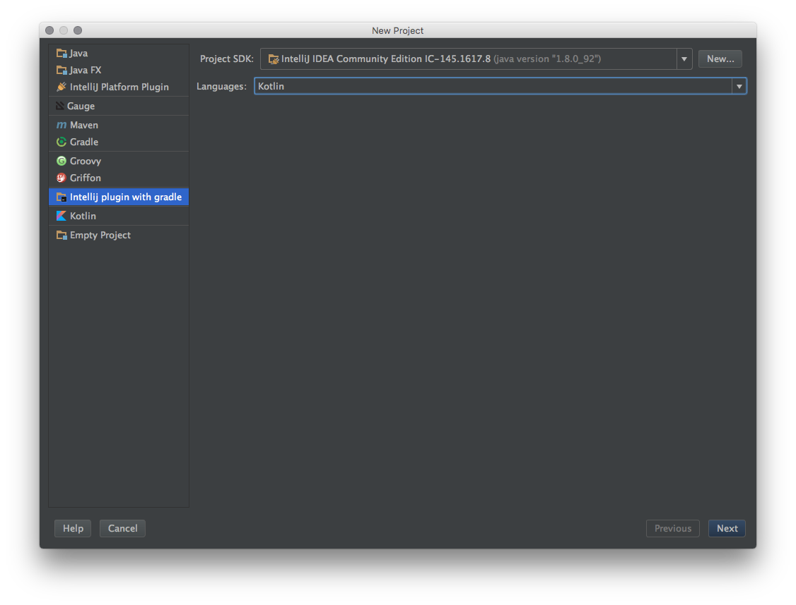
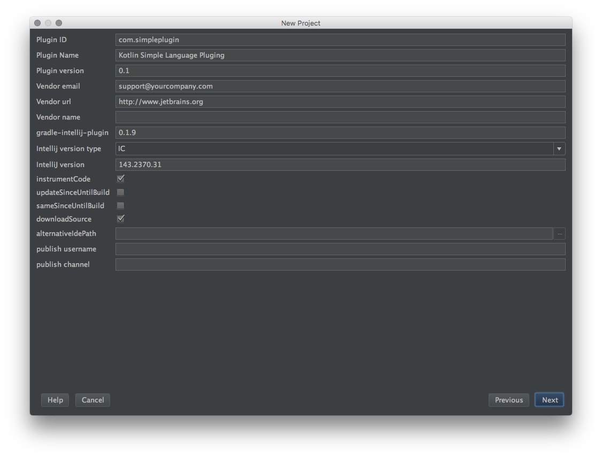
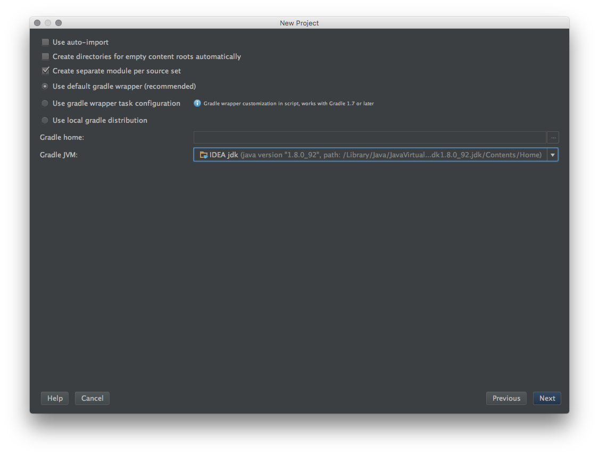
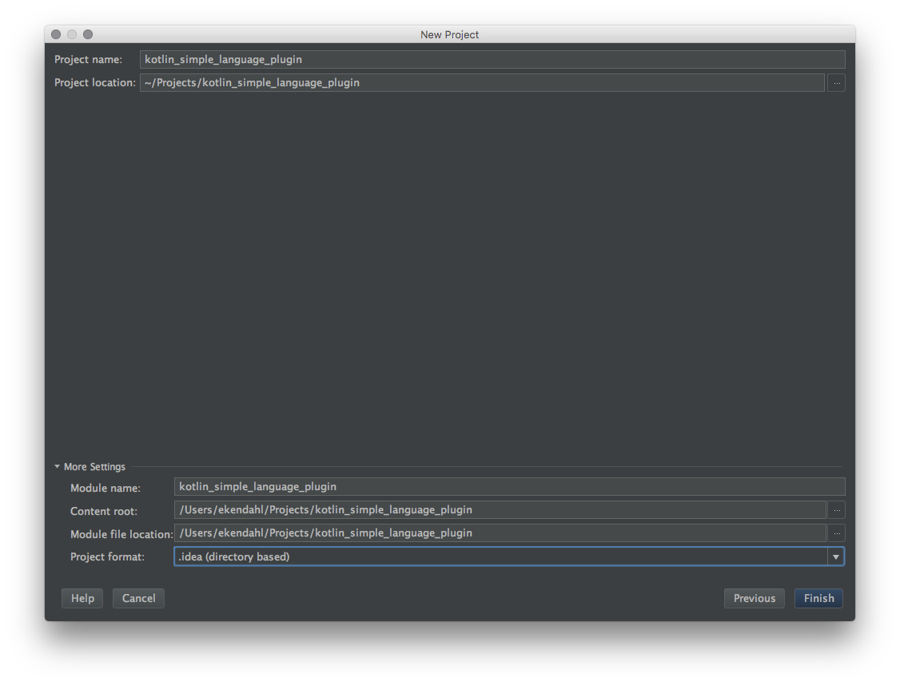
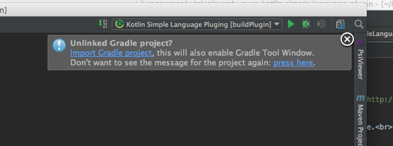
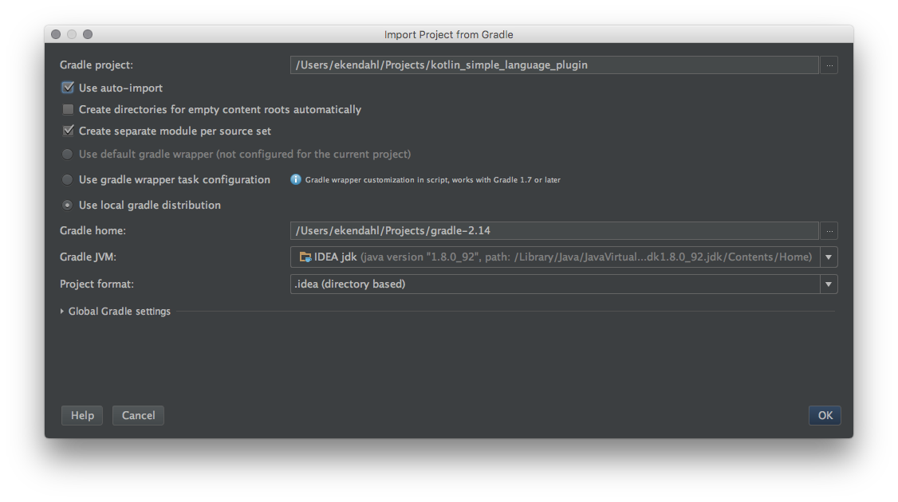
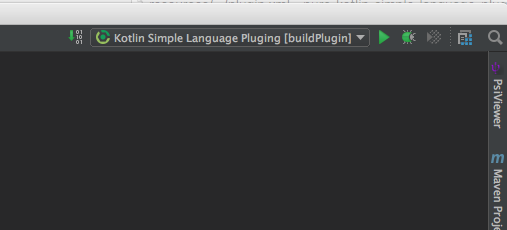

# Prerequisites:
 
 * Follow the the steps on JetBrain's [Prerequisites Page](http://www.jetbrains.org/intellij/sdk/docs/tutorials/custom_language_support/prerequisites.html)
 * Install the [intellij-plugin-with-gradle-wizard](https://github.com/shiraji/intellij-plugin-with-gradle-wizard)
 
Create a new project called `kotlin_simple_language_plugin` using the following steps
 

 

Once the project is created you will see the following pop-up telling you your project is unlinked. Click the link to import the project!

Then pick the following settings:

Once imported you should see the new Gradle Build Targets in the top right corner like this:

At this point you are ready to start reading chapter [2: Language & File Types](language_and_filetype.md)
